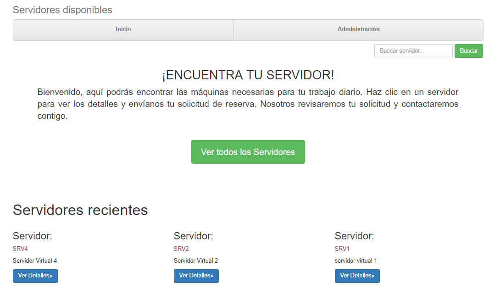
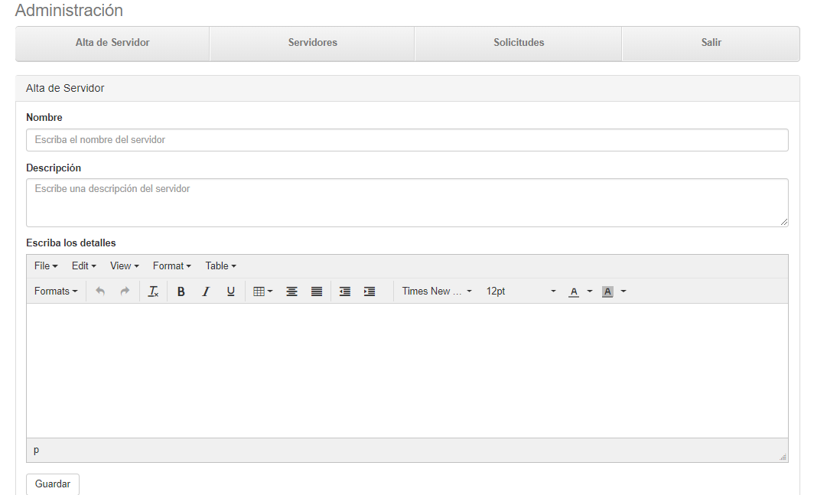
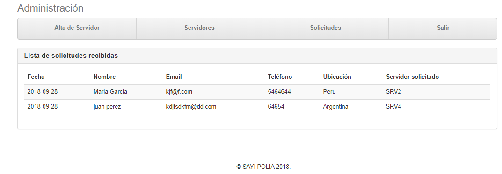
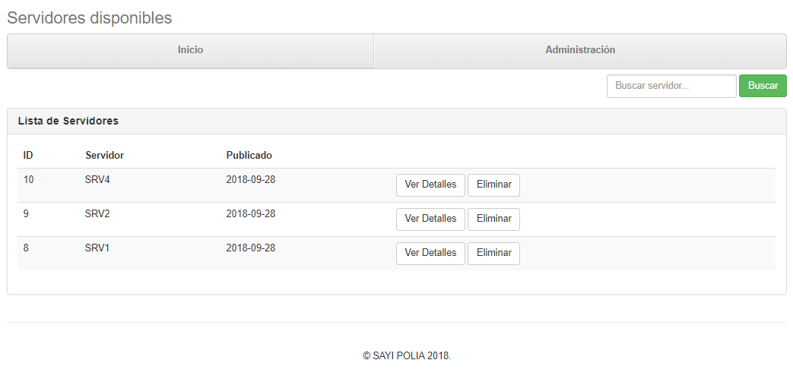

#PROYECTO SERVIDORES 

Descripcion
===========
###El fin de esta aplicacion web es poder visualizar servidores con sus caracteristicas y reservalos. Tiene sesion de administrador el cual dara de alta/eliminar servidores como asi responder a solicitudes.
###Esta realizado con **JAVA 8 EE**, **TOMCAT8**, **MYSQL**, y el FrontEnd con **BOOTSTRAP**. 

####Se dejan imagenes liustrativas del proyecto.

